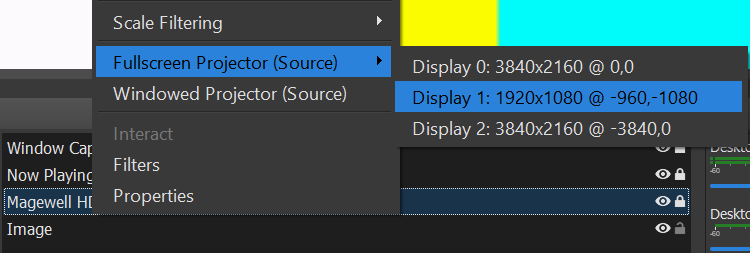
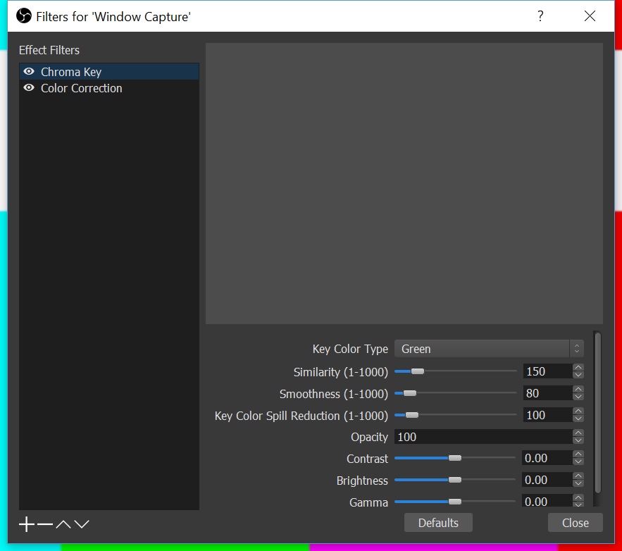

# PuyoSpectatorAssist2
An updated version of the SpectatorAssist2. Updates faster than the old one.
Example: https://twitter.com/S2LSOFTENER/status/1083272334683893761

# Setup Instructions
You'll need an extra 1920x1080 monitor for this tool to work. I haven't gotten around to adding more options yet.

## 1. Install Python
Download Python 3.7+ and add it to your environment variables.
https://www.python.org/downloads/

## 2. Clone the repository
You can do that with git or by downloading it from this page

## 3. Open OBS and find your monitor coordinates
Right click your capture card source and find Fullscreen Projector > the display you'll end up projecting to. 


Write down the numbers after the @ symbol. You'll need them. Now you can go ahead and project your capture card source to the other monitor.

## 4. Specify monitor coordinates in create_overlay_img.py
```python
    def captureScreen(self):
        ...
            with mss() as sct:
                # Get information of monitor 1
                monitor_number = 1
                mon = sct.monitors[monitor_number]

                # The screen part to capture
                monitor = {
                    "top": -1080, # Replace
                    "left": -960, # these two numbers
                    "width": 1920,
                    "height": 1080,
                    "mon": monitor_number,
                }
        ...
```
Replace the numbers with the coordinates from Step 3. If it doesn't work later on, you might need to change the monitor_number... idk...

## 5. Run main.py and add it to OBS
Run the script with:
```
python main.py
```
A green window should pop up. Use OBS to Window Capture it.

## 6. Apply green chroma key
I couldn't figure out how to make a transparent window in Windows, so you'll have to remove the background with a chroma key. Right click the window capture source > Filters > Press the plus to add a Chroma Key.

You can also add a Color Correction filter to edit the source's opacity. That way the Spectator Assist overlay will be more subtle.


# To Do
* Create GUI tool for choosing your screen region.
* Currently, the tool checks for chains every 2 frames, so it gets visually annoying. Make the tool only check for chains after each piece placement.
* Package the tool somehow so people don't need their own Python installations? What do people use for this?